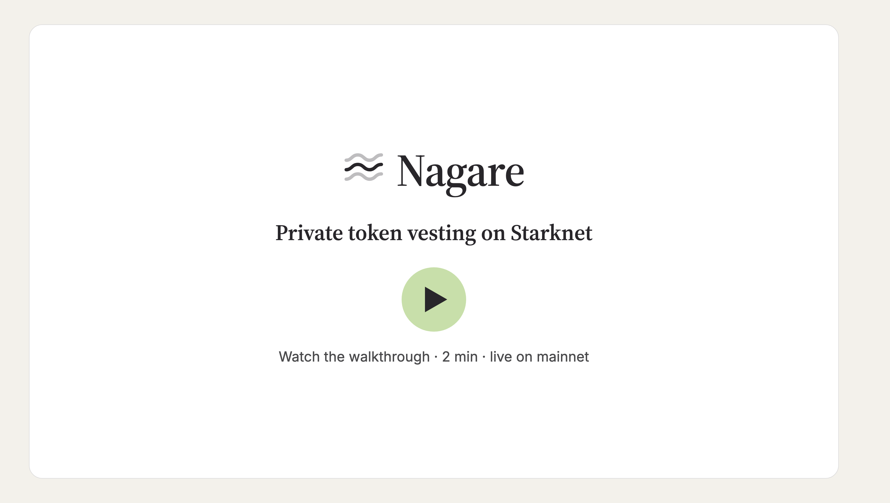
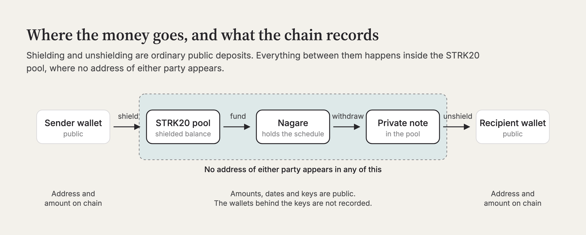
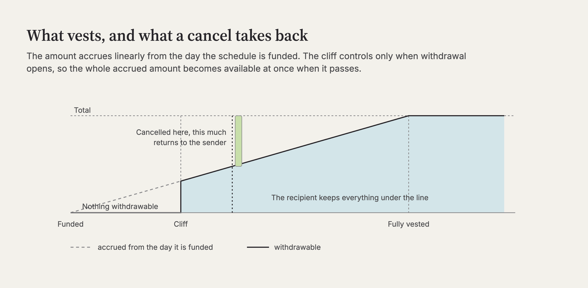
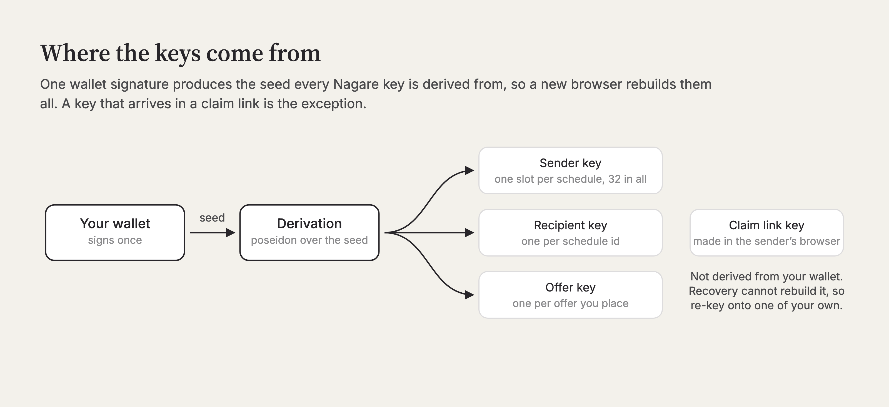

# Nagare

[](https://voyager.online/contract/0x00ae22ea6b8c2e10bb19450d4caac7d31c89168379e4aef02d83e3eb8f03e323)
[](tests/test_nagare.cairo)
[](#status)
[](LICENSE)
[](https://nagare-6go.pages.dev)

Private token vesting on Starknet. A sender funds a lockup from a shielded STRK20
balance, the recipient withdraws what has vested into a private note, and no wallet
address of either party appears in any Nagare transaction.

Nagare is a STRK20 anonymizer. Each side of a schedule is a Stark-curve public key
generated in the browser, and every withdrawal, cancellation, re-key and sale is an ECDSA
signature over the operation, bound to the chain, the contract, the schedule, the note
being paid into and a nonce.

[](https://youtu.be/rvvzpcRo0bw)

A two minute walkthrough of the app against mainnet, ending on a real funding transaction
where the explorer reports that the public trail stops at the pool.

## Why keys instead of addresses

Every on-chain vesting contract today publishes the cap table. Open a Tokei or Sablier
stream on Voyager and you see who funds whom, on what schedule and for how much, and that
record lasts as long as the chain does. Nagare moves the funding and the payouts inside
the STRK20 pool: the pool pays Nagare and Nagare pays the pool, so neither wallet ever
appears next to the other.



## What the chain can and cannot see

| Not disclosed on-chain | Disclosed on-chain |
|---|---|
| The wallet address that funded a schedule | Each schedule's total, token, start, cliff, end, and its id |
| The wallet address that receives it | The sender key and recipient key of every schedule (pseudonyms), and every re-key |
| The wallet address that canceled, transferred, listed, offered or accepted | Nagare's STRK balance and per-token liability |
| Which wallet owns the open note a payout lands in | Each withdrawal's, refund's and sale's amount and time |
| | Whether a schedule is listed for sale, and every offer's price, expiry and buyer key |
| | Every signature and every calldata item, including note ids |

Amounts, schedules and timing are public, and the right-hand column is long on purpose. A
distinctive amount withdrawn shortly after a distinctive shield can be correlated. A key reused across
schedules links those schedules, which is why sender keys are per schedule. Shielding
itself publishes the depositor's address and the amount. The claim is that no wallet
address of either party appears in any Nagare transaction, and it does not extend past
that.

## Operations

All eight run through `privacy_invoke`, callable only by the STRK20 pool.

| Op | Who signs | What it does |
|---|---|---|
| Create | nobody (the pool's withdraw is the authorization) | Opens a schedule from a shielded balance |
| Withdraw | recipient key | Pays the vested, unwithdrawn amount into an open note |
| Cancel | sender key | Refunds the unvested part; the vested part stays claimable |
| Transfer | recipient key | Re-keys the position to a new holder |
| List | recipient key | Opens or closes the schedule to offers |
| Offer | nobody (the buyer's escrow is the authorization) | Escrows a price against a listed schedule |
| Accept | recipient key | Re-keys to the buyer and pays the price into the seller's note |
| Reclaim | buyer key | Returns an unaccepted escrow to the buyer |

Vesting is linear from `start` to `end` with a `cliff` before which nothing is
withdrawable, the same curve as Tokei's LockupLinear.



The contract's ABI calls a schedule a stream, in `get_stream`, `stream_count` and every
`stream_id` argument. It is deployed with no upgrade path, so those names are fixed;
everything a person reads says schedule.

Every operation is a STRK20 private transaction, and the pool charges a flat 6 STRK fee
for each one, taken from the sender's shielded balance on top of the amount being moved.
The pool collects that fee, and Nagare takes nothing.

## Selling a schedule

A holder can open their schedule to offers, and a buyer escrows a price against it under a
key derived from their own wallet. Accepting moves the schedule to that key and pays the
holder in one call. Two rules protect the buyer: an offer can only be accepted while the
withdrawn amount still matches what it was when the offer was made, and a live offer
blocks a transfer.

Neither rule covers the sender. A sale writes `recipient_pk` and leaves `sender_pk` alone,
so on a cancelable schedule the sender can still cancel after the sale and take the
unvested part back from the buyer. Only an uncancelable schedule is safe to buy without
trusting whoever opened it.

Offers are numbered, and each one's escrow belongs to its number. A new offer does not
clear an older one, so an offer that expires keeps its STRK in the contract until its
buyer reclaims it, under the key that made it.

## Keys

One wallet signature produces a seed, and every key Nagare needs is derived from it by a
fixed path, so a new browser rebuilds them from the wallet alone. What the browser keeps
is a public key and the path it came from, which is enough to know which schedules are
yours and useless to anyone who steals it.



The exception is a key that arrives in a claim link, which the sender generated in their
own browser. That one is held in the browser itself, and no wallet can rebuild it, so a
recipient should re-key onto a key of their own as soon as they arrive. [Keys and recovery](https://nagare-6go.pages.dev/docs/keys)
covers what that means in practice.

## Try it

[nagare-6go.pages.dev](https://nagare-6go.pages.dev) reads mainnet directly. Browsing
needs no wallet; opening or moving a schedule needs Ready with STRK20 enabled.

The [docs](https://nagare-6go.pages.dev/docs) cover the key model, a guide for each side
of a schedule, recovery, and a reference with the contract, the disclosure table and every
error the app can show.

## Deployment

Live on Starknet mainnet, against the STRK20 pool at
`0x040337b1af3c663e86e333bab5a4b28da8d4652a15a69beee2b677776ffe812a`, with STRK as the
only admitted token.

| | |
|---|---|
| Contract | [`0x00ae22ea6b8c2e10bb19450d4caac7d31c89168379e4aef02d83e3eb8f03e323`](https://voyager.online/contract/0x00ae22ea6b8c2e10bb19450d4caac7d31c89168379e4aef02d83e3eb8f03e323) |
| Class hash | [`0x0015bbc96d70c0a295000cdbb433f00f258427e48eaaaa58fb2d864db898abb8`](https://voyager.online/class/0x0015bbc96d70c0a295000cdbb433f00f258427e48eaaaa58fb2d864db898abb8) |

There is no owner, no pause and no upgrade path. A fix means a new class at a new
address, and this table is how you tell which one you are looking at.

The class is verified on Voyager, so the Cairo behind that address is readable next to it
without taking this repository's word for the match.

## Status

Create, Withdraw and Cancel are proven on Starknet mainnet, each carrying pool events and
a Nagare event; the hashes are in [`strk20.json`](strk20.json). List has also run against
the deployed contract, and schedule 7 was opened uncancelable, carrying
`0x3beacfb8418e802316632224f14b0902b6f61b5c7f06b18843cd1e0d39fac52` as its sender key,
which is the published constant no private key exists for.

The contract has 46 tests green under snforge, including a signature vector generated in
TypeScript and verified in Cairo so the browser signer and the contract cannot drift.

Schedule 6 has been through the whole sale path on mainnet: listed, offered against
twice, accepted at generation 2, and then withdrawn from by its new holder. Transfer and
Reclaim are implemented and covered by tests, and have not run against the deployed
contract yet.

[`strk20.json`](strk20.json) carries one mainnet hash for each operation that has run:
Create, Withdraw, Cancel, List, Offer, Accept, and the buyer's withdrawal after the sale.
Every one of them succeeded and carries events from both the pool and Nagare.

Not audited.

## Build

```
scarb build
snforge test
```

Toolchain versions are pinned in `.tool-versions`.

The web client is in [`web/`](web). The demo video and the schematics above are built
from [`media/demo-src/`](media/demo-src).

## License

MIT, see [LICENSE](LICENSE).
